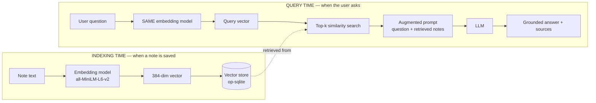
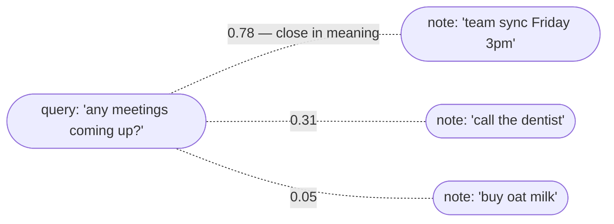
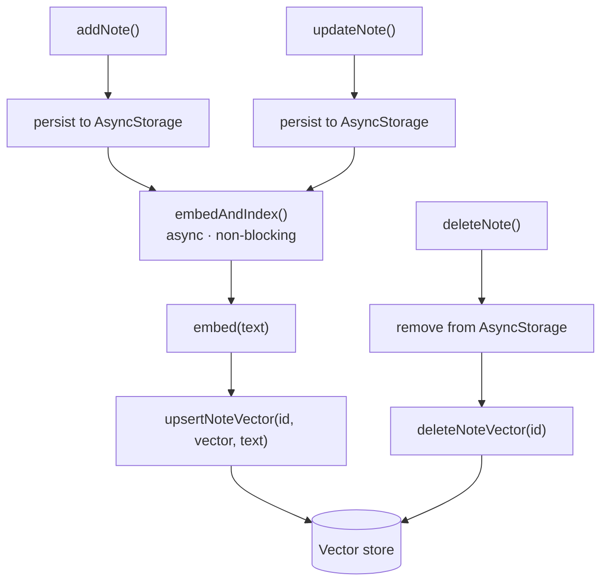
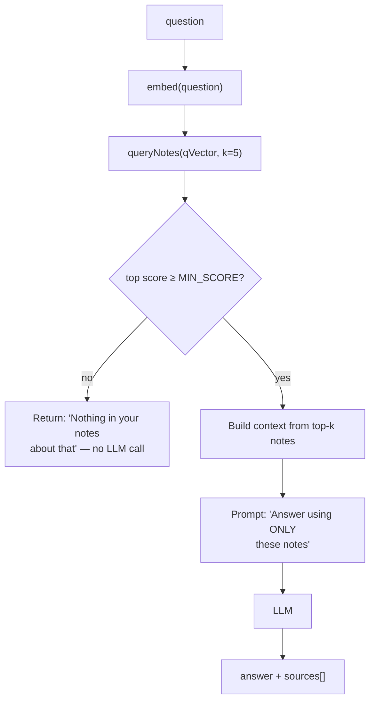
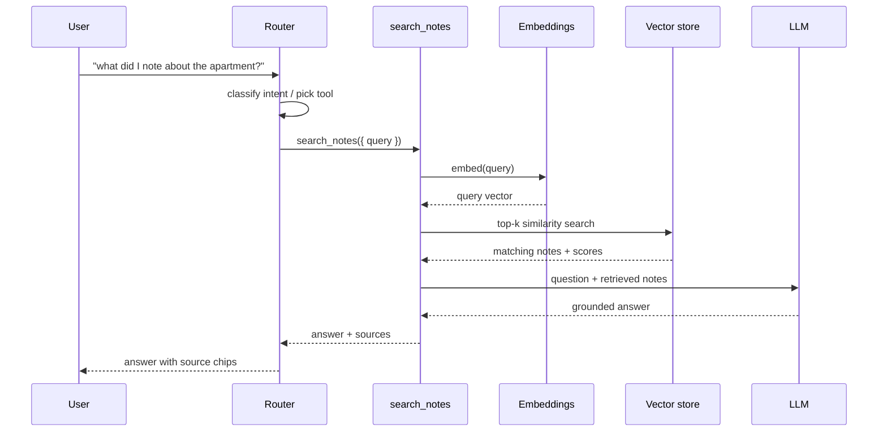
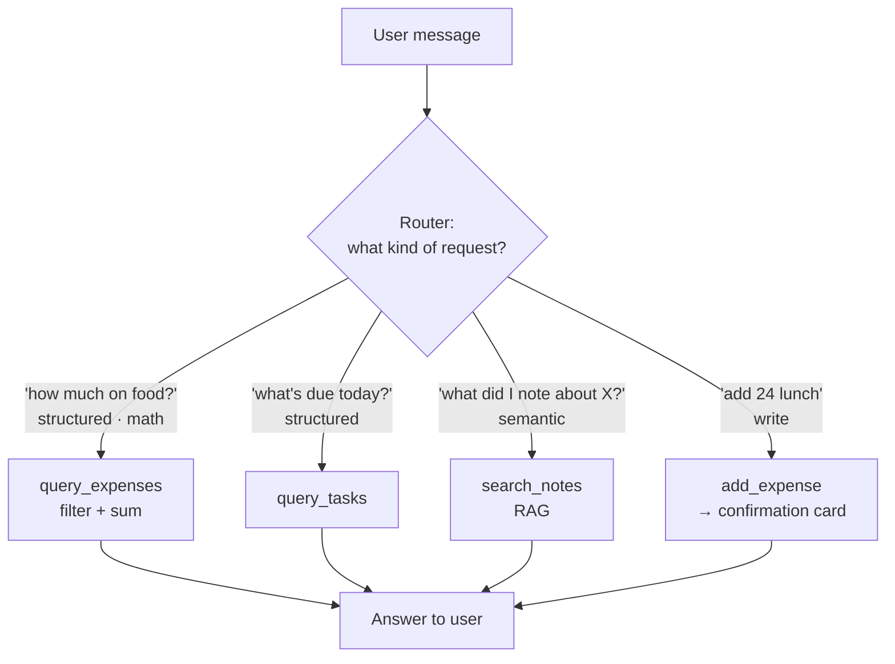

# Phase 1 — On-Device RAG over Quick Notes

**Goal:** Add semantic search and RAG-powered Q&A over your existing Quick Notes, running fully on-device, exposed as a single `search_notes` tool that your assistant router can call alongside the structured-query tools (`query_expenses`, etc.).

**Why this scope:** It's the smallest slice that teaches you the *entire* RAG pipeline — embeddings → vector store → retrieval → augmented generation — and it slots cleanly into the agentic-tool architecture you already designed. Everything else (cloud fallback, chunking long docs, re-ranking, image/voice search) is deferred to later phases.

> **Learning intent:** This plan is written as a ladder. Each step has a *checkpoint* — a thing you should be able to observe working — before you move on. Don't skip the manual cosine-similarity step (Step 3); building it once by hand is what makes RAG stop being magic.

---

## 0. Prerequisites & how it fits your app

You already have:
- `QuickNotesContext` (notes live here, persisted via `storageService.js` / AsyncStorage)
- The assistant layer plan: `AssistantContext`, `src/services/ai/provider.js`, `src/services/ai/tools.js` with a `DISPATCH` map and a tool router

Phase 1 adds a parallel **retrieval store** for note embeddings. Important architectural rule, same as before: **the RAG layer never becomes the source of truth for notes.** Notes still live in `QuickNotesContext` + AsyncStorage. The vector store is a derived index keyed by `noteId`. If it's ever lost, you rebuild it from the notes (Step 6). This keeps one source of truth and makes the embedding store disposable/regenerable.

```
QuickNotesContext (source of truth: note text)
        │  on add/edit/delete
        ▼
  Embeddings service ──► Vector store (noteId → vector)   ← derived, rebuildable
        ▲                         │
        │                         ▼
  search_notes tool ◄──── retrieval (top-k) ──► augmented prompt ──► LLM answer
        ▲
        │ registered in tools.js
   Assistant router
```

---

## RAG — Visual Reference

> These render in GitHub and most markdown viewers. They map 1:1 onto the steps below — use them as the mental model while you build.

### A. The two phases of RAG

The single most important idea: **the same embedding model is used at indexing time and at query time.** That shared model is what makes a question's vector land near the notes that answer it.



### B. Why semantic search beats keyword search

Cosine similarity compares *meaning*, not words. A query can match a note with **zero shared keywords** — that's the whole point, and the thing you'll prove yourself in Step 3.



*"meetings" and "team sync" share no words but sit close in vector space; "oat milk" is far away. Retrieval = sort by closeness, take the top k.*

### C. Indexing flow — keeping the index in sync (Step 5)

Notes stay the source of truth; the vector store is a derived mirror. Save first, embed after, so the UI never blocks.



### D. Query pipeline with the relevance gate (Step 7)

The `MIN_SCORE` gate is what stops the model from confidently answering off irrelevant notes. No good match → honest "I don't know."



### E. End-to-end query (the sequence)



### F. Agentic RAG — the router's choice (Step 8)

This is the payoff. `search_notes` is just one tool. The router sends **semantic** questions to RAG and **structured** questions to query functions — and writes to confirmation-gated tools. Picking the right path *is* agentic RAG.



*Note the failure mode this avoids: "notes from yesterday" looks like a notes question but needs a date filter, not similarity. The router — not `search_notes` — is where that gets sent to a structured path instead.*

---

## 1. Dependencies & setup

> Library APIs in this space move fast. Treat the snippets below as shape, not gospel — check each package's current README for exact signatures before wiring.

Install the on-device RAG stack:

```bash
npm install react-native-rag
npm install @react-native-rag/executorch       # on-device embeddings + LLM
npm install @react-native-rag/op-sqlite         # persistent vector store
npm install @op-engineering/op-sqlite
```

Then:
- Follow `react-native-executorch` native setup (iOS pods, Android NDK config). This is the step most likely to fight you — budget real time for it.
- Enable vector support in op-sqlite per its docs (a flag in your config/package setup).
- iOS: increase the memory entitlement if the docs call for it (model loading is memory-heavy).

**Model assets:**
- Embedding model: **all-MiniLM-L6-v2** (384-dim, ~80 MB). Bundle it or download-on-first-run.
- LLM for the generation step: a small quantized instruct model compatible with ExecuTorch (1–3B). For Phase 1 you can even stub generation (Step 7) and validate retrieval first.

**Checkpoint 1:** App builds and launches on a real device (not just simulator — on-device inference behaves differently on hardware) with the new native deps. No RAG logic yet. Just confirm it doesn't crash on boot.

---

## 2. Embeddings service

Create `src/services/ai/embeddings.js`. One responsibility: text in → vector out. Load the model once and reuse it.

```js
// Illustrative shape — confirm against react-native-executorch / react-native-rag docs
let embedder = null;

export async function initEmbedder() {
  if (embedder) return embedder;
  embedder = await loadEmbeddingModel('all-MiniLM-L6-v2'); // per library API
  return embedder;
}

export async function embed(text) {
  const model = await initEmbedder();
  return model.encode(text); // returns Float32Array length 384
}
```

**Checkpoint 2:** Add a throwaway debug button that calls `embed("buy milk")` and logs the vector. You should see ~384 numbers. Embed two similar strings ("team sync" and "meeting with the team") and two unrelated ones; eyeball that you can later tell them apart. You don't need to compute similarity yet — just confirm vectors come out and are stable (same input → same vector).

---

## 3. LEARNING STEP — in-memory cosine similarity (do not skip)

Before touching a vector database, implement retrieval by hand so you understand what the DB will later do for you. Keep this in a scratch file you'll delete.

```js
function cosineSimilarity(a, b) {
  let dot = 0, normA = 0, normB = 0;
  for (let i = 0; i < a.length; i++) {
    dot += a[i] * b[i];
    normA += a[i] * a[i];
    normB += b[i] * b[i];
  }
  return dot / (Math.sqrt(normA) * Math.sqrt(normB));
}

// Embed all notes once, hold vectors in a plain array, then:
async function searchInMemory(query, notes) {
  const q = await embed(query);
  return notes
    .map(n => ({ note: n, score: cosineSimilarity(q, n.vector) }))
    .sort((a, b) => b.score - a.score)
    .slice(0, 5);
}
```

**Checkpoint 3 (the important one):** With ~10 hand-made notes, search "where am I meeting Sarah" and confirm a note like "lunch with Sarah at noon" ranks above an unrelated note about groceries — *even though they share no keywords*. The moment that works, you understand retrieval. Everything after this is persistence and plumbing.

---

## 4. Persistent vector store (op-sqlite)

Now replace the in-memory array with the real store so embeddings survive app restarts. Create `src/services/ai/vectorStore.js`.

```js
// Illustrative — follow @react-native-rag/op-sqlite API for exact calls
import { OpSqliteVectorStore } from '@react-native-rag/op-sqlite';

let store = null;

export async function initVectorStore() {
  if (store) return store;
  store = new OpSqliteVectorStore({ table: 'note_embeddings', dimension: 384 });
  await store.init();
  return store;
}

export async function upsertNoteVector(noteId, vector, text) {
  const s = await initVectorStore();
  await s.upsert({ id: noteId, vector, metadata: { text } });
}

export async function deleteNoteVector(noteId) {
  const s = await initVectorStore();
  await s.delete(noteId);
}

export async function queryNotes(queryVector, k = 5) {
  const s = await initVectorStore();
  return s.search(queryVector, k); // returns [{ id, score, metadata }]
}
```

Store the note's text in metadata so retrieval returns the content directly without a second lookup into `QuickNotesContext`. (You *could* look it up by id instead — either is fine; metadata is simpler for Phase 1.)

**Checkpoint 4:** Re-run the Step 3 search but through the store. Kill and relaunch the app; confirm search still works without re-embedding. Persistence achieved.

---

## 5. Embed-on-save — hook into QuickNotesContext

Make the index stay in sync automatically. In `QuickNotesContext`, after each successful note mutation, update the vector store. Keep it fire-and-forget so note saving never blocks on embedding.

```js
// inside QuickNotesContext actions
const addNote = async (note) => {
  const saved = await persistNote(note);           // existing path (AsyncStorage)
  embedAndIndex(saved).catch(logError);            // async, non-blocking
  return saved;
};

const updateNote = async (note) => {
  const saved = await persistNote(note);
  embedAndIndex(saved).catch(logError);            // re-embed on edit
  return saved;
};

const deleteNote = async (id) => {
  await removeNote(id);                             // existing path
  deleteNoteVector(id).catch(logError);
};

async function embedAndIndex(note) {
  const vector = await embed(note.text);
  await upsertNoteVector(note.id, vector, note.text);
}
```

Design notes:
- **Non-blocking:** a slow embed must never make the note UI feel laggy. Save first, index after.
- **Edit = re-embed:** changed text means a stale vector; overwrite it.
- **Delete = remove vector:** otherwise search surfaces ghosts.
- Consider a tiny `embedStatus` flag per note (`pending`/`done`) if you want to show indexing state or retry failures later. Optional for Phase 1.

**Checkpoint 5:** Add a new note through the normal UI, then search for it semantically — no manual re-index. Edit it, search again, confirm the new content is found. Delete it, confirm it stops appearing.

---

## 6. Backfill existing notes (one-time migration)

Users (you) already have notes with no vectors. On first launch after this feature ships, embed everything once.

```js
export async function backfillNoteEmbeddings(allNotes) {
  const store = await initVectorStore();
  const existing = await store.listIds();          // ids already indexed
  const missing = allNotes.filter(n => !existing.includes(n.id));
  for (const note of missing) {                    // sequential = gentler on memory
    const vector = await embed(note.text);
    await upsertNoteVector(note.id, vector, note.text);
  }
}
```

Run it once from `AssistantProvider` init (or behind a "rebuild search index" button in Settings — useful for recovery, since the store is rebuildable by design). Show a small progress indicator if the user has many notes; embedding is CPU-bound.

**Checkpoint 6:** Wipe the vector table, relaunch, let backfill run, confirm all old notes become searchable. This proves the "derived, rebuildable" property.

---

## 7. Augmented generation — the actual "RAG"

Retrieval alone gives you semantic search. RAG = feed the retrieved notes to the LLM so it answers in prose. Create `src/services/ai/ragAnswer.js`.

```js
export async function answerFromNotes(question) {
  const q = await embed(question);
  const hits = await queryNotes(q, 5);

  if (hits.length === 0 || hits[0].score < MIN_SCORE) {
    return { answer: "I couldn't find anything in your notes about that.", sources: [] };
  }

  const context = hits
    .map((h, i) => `[Note ${i + 1}] ${h.metadata.text}`)
    .join('\n\n');

  const prompt =
    `Answer the question using ONLY the notes below. ` +
    `If the notes don't contain the answer, say so.\n\n` +
    `NOTES:\n${context}\n\nQUESTION: ${question}`;

  const answer = await aiProvider.chat([{ role: 'user', content: prompt }]);
  return { answer, sources: hits.map(h => ({ id: h.id, text: h.metadata.text })) };
}
```

Two things worth internalizing here:
- **The `MIN_SCORE` floor** prevents the model from confidently answering off three irrelevant notes. Tune it by watching real scores from Step 3/4.
- **"ONLY the notes below"** in the prompt is what makes it RAG and not just the model guessing. Returning `sources` lets your UI show which notes the answer came from — do this; it builds trust and helps you debug bad answers.

**Checkpoint 7:** Ask "what did I decide about the apartment?" and get a prose answer grounded in your actual notes, with the source notes listed. Ask something you definitely never noted and confirm it says it doesn't know (not a hallucination).

---

## 8. Expose as a tool + wire to the router

Now make it callable by the assistant, fitting the agentic pattern. In `src/services/ai/tools.js`:

```js
// add to TOOLS
{
  name: "search_notes",
  description: "Search the user's personal notes to answer questions about things they wrote down.",
  args: { query: "string — the user's question or search phrase" },
}

// add to DISPATCH
search_notes: async ({ query }) => answerFromNotes(query),
```

`search_notes` is **read-only**, so unlike the write tools (`add_expense`, etc.) it does **not** go through a confirmation card — it answers immediately. The router now has a real choice to make: structured tools for "how much on food this month," `search_notes` for "what did I note about X." That router decision *is* agentic RAG.

**Checkpoint 8:** Through the assistant chat, ask a notes question and confirm the router picks `search_notes` (log the chosen tool). Ask an expense question and confirm it does *not* pick `search_notes`. Getting this routing right is the whole payoff.

---

## 9. Minimal UI surface

Keep it small for Phase 1:
- In the assistant chat, render `search_notes` answers with the `sources` notes shown as tappable chips that open the original note.
- Optionally, a plain semantic-search box in the Quick Notes screen that lists `queryNotes` results directly (no LLM) — cheap to add since retrieval already exists, and it's a nice non-AI win.

**Checkpoint 9:** End-to-end through real UI, on a real device, offline (airplane mode) — confirms the on-device promise actually holds.

---

## Testing & verification checklist

- [ ] App builds/runs on a physical iOS and Android device with native deps
- [ ] `embed()` returns stable 384-dim vectors
- [ ] Hand-rolled cosine ranks semantically-related notes above keyword-unrelated ones
- [ ] Vector store survives app restart
- [ ] New/edited/deleted notes stay in sync automatically
- [ ] Backfill indexes all pre-existing notes; "rebuild index" recovers from a wiped store
- [ ] RAG answer is grounded in real notes and lists sources
- [ ] Out-of-scope question yields "I don't know," not a hallucination
- [ ] Router calls `search_notes` for notes questions and structured tools otherwise
- [ ] Whole flow works in airplane mode

---

## What Phase 1 deliberately skips (so you don't scope-creep)

- **Chunking** long notes — Phase 1 embeds whole notes. Fine until notes get long; then you split into passages and embed each. (Phase 2)
- **Cloud fallback** — all on-device for now. The `aiProvider` abstraction means you can add a cloud backend later without touching this code.
- **Re-ranking / hybrid keyword+vector search** — pure vector for now.
- **RAG over other modules** — meetings notes, etc. come later once the pattern is proven on Quick Notes.
- **Voice / image semantic search** — later phases of the same tutorial path.

## Known limitation to expect (and that's the point)

Semantic search will be *bad* at date/number/filter questions ("notes from yesterday," "notes mentioning over $100"). That's expected — those need structured reasoning, not similarity. Don't try to fix it inside `search_notes`. The fix is the router sending those to a structured tool instead. Hitting this wall yourself is the lesson that makes the agentic-RAG split click.

---

## What you'll have learned by the end

- How embeddings turn text into geometry, and why similar meaning ≈ nearby vectors
- How retrieval is just nearest-neighbour search (you'll have written the cosine math once)
- How a vector store persists and indexes that
- How "augmentation" is literally just putting retrieved text in the prompt with a grounding instruction
- Why retrieval has to stay derived/rebuildable, not a second source of truth
- Where pure RAG fails and why agentic routing is the 2026 answer — by feeling the failure, not just reading about it

## Suggested file checklist

```
src/services/ai/embeddings.js      # init + embed()
src/services/ai/vectorStore.js     # op-sqlite upsert/delete/query
src/services/ai/ragAnswer.js       # answerFromNotes() — retrieval + augmented prompt
src/services/ai/tools.js           # + search_notes in TOOLS and DISPATCH
src/context/QuickNotesContext.js   # embed-on-save/edit/delete hooks
src/context/AssistantContext.js    # run backfill on init
# scratch file for Step 3 cosine — delete after Checkpoint 3
```


More Notes on RAG Implementation :

What we just built — Step 2 explained
embeddings.js is a singleton service with two jobs:

initEmbedder() — loads the model once, caches it. The if (embedder) return embedder guard means subsequent calls are instant — the model stays loaded in memory.
embed(text) — calls initEmbedder() then runs the text through the model's forward() pass, returning 384 numbers.
Why all-MiniLM-L6-v2: It's the sweet spot for mobile — small (~80 MB), fast (runs in milliseconds on device), and produces 384-dimensional vectors that capture meaning well enough for personal note search.

initExecutorch in _layout.js: This runs once at module load and tells the ExecuTorch runtime to use Expo's file system for downloading model weights. Without this, the model loader wouldn't know how to fetch files on Expo.

What those 384 numbers mean: Each piece of text gets mapped to a fixed point in 384-dimensional space. Texts with similar meaning land near each other. That's the entire foundation of everything we build next.